# Base16 for DrRacket

See the [Base16 Repository](https://github.com/chriskempson/base16)
for more information. This theme was built with [Base16
builder](https://github.com/chriskempson/base16-builder).

## Installation

Each theme is contained in it's own package folder within `base16-theme`. Individual themes can be installed by running:

```shell
raco pkg install {PATH TO THEME FOLDER}
```

I.e. from the `base16-theme` folder:

```shell
raco pkg install ./base16-default
```

Alternatively, all themes can be installed by running:

```shell
raco pkg install {PATH TO}/base16-theme
```

The themes can also be installed directly from GitHub:

```shell
raco pkg install git://github.com/tuirgin/base16-drracket
```

## Screenshots

| Scheme Name            | Screenshot                                                                                     |
|-----------------------:|:-----------------------------------------------------------------------------------------------|
| 3024 Dark              | 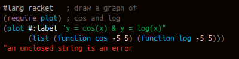                                        |
| 3024 Light             | 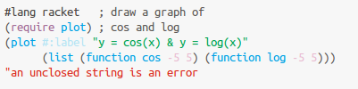                                     |
| Ashes Dark             | 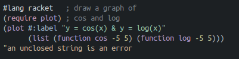                                     |
| Ashes Light            | 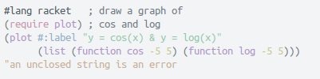                                  |
| Atelier Dune Dark      | 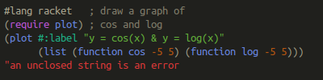                |
| Atelier Dune Light     | 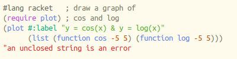             |
| Atelier Forest Dark    | 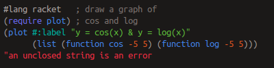          |
| Atelier Forest Light   | 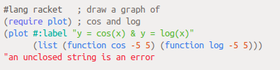       |
| Atelier Heath Dark     | 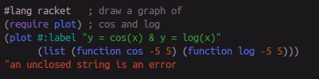             |
| Atelier Heath Light    | 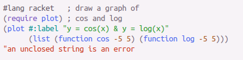          |
| Atelier Lakeside Dark  | 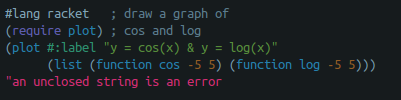    |
| Atelier Lakeside Light | 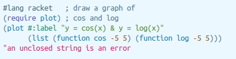 |
| Atelier Seaside Dark   | 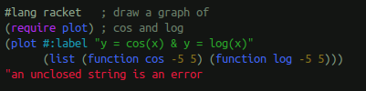       |
| Atelier Seaside Light  | 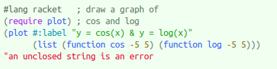    |
| Bespin Dark            | 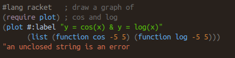                                  |
| Bespin Light           | 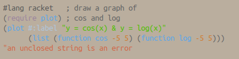                               |
| Brewer Dark            | 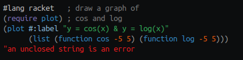                                  |
| Brewer Light           | 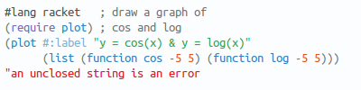                               |
| Chalk Dark             | 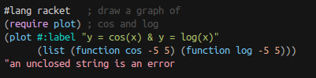                                     |
| Chalk Light            | 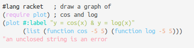                                  |
| Default Dark           | 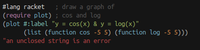                               |
| Default Light          | 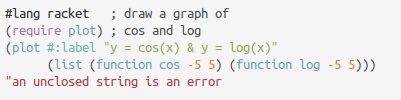                            |
| Eighties Dark          | 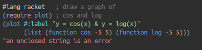                            |
| Eighties Light         | 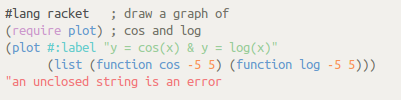                         |
| Google Dark            | 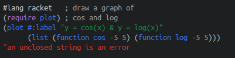                                  |
| Google Light           |                                |
| Grayscale Dark         | 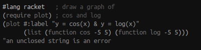                         |
| Grayscale Light        | 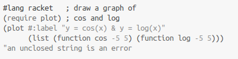                      |
| Green Screen Dark      | 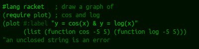                |
| Green Screen Light     |              |
| Isotope Dark           |                                |
| Isotope Light          | 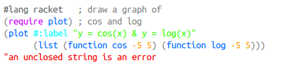                            |
| London Tube Dark       | 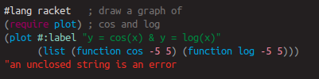                   |
| London Tube Light      | 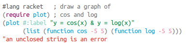                |
| Marrakesh Dark         | 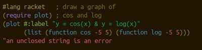                         |
| Marrakesh Light        | 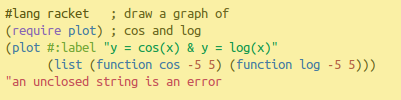                      |
| Mocha Dark             | 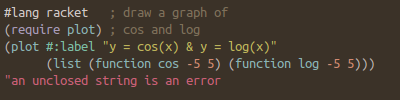                                     |
| Mocha Light            | 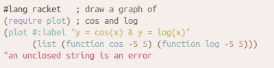                                  |
| Monokai Dark           | 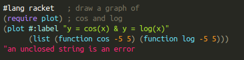                               |
| Monokai Light          | 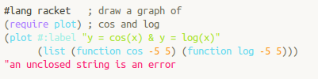                            |
| Ocean Dark             | 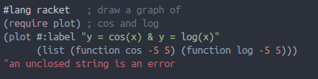                                     |
| Ocean Light            | 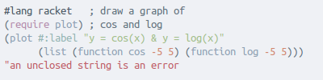                                  |
| Paraiso Dark           | 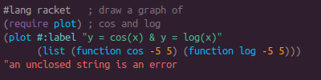                               |
| Paraiso Light          | 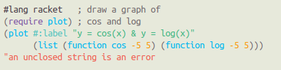                            |
| Railscasts Dark        | 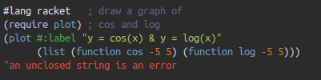                      |
| Railscasts Light       | 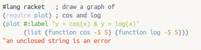                   |
| Shapeshifter Dark      | 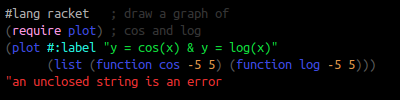                |
| Shapeshifter Light     | 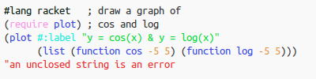             |
| Solarized Dark         | 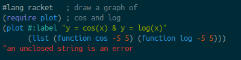                         |
| Solarized Light        | 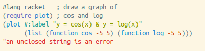                      |
| Tomorrow Dark          | 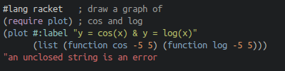                            |
| Tomorrow Light         | 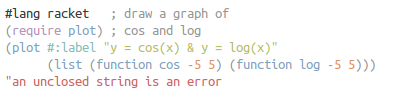                         |
| Twilight Dark          | 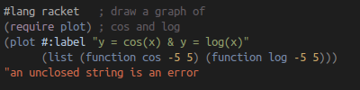                            |
| Twilight Light         |                          |
